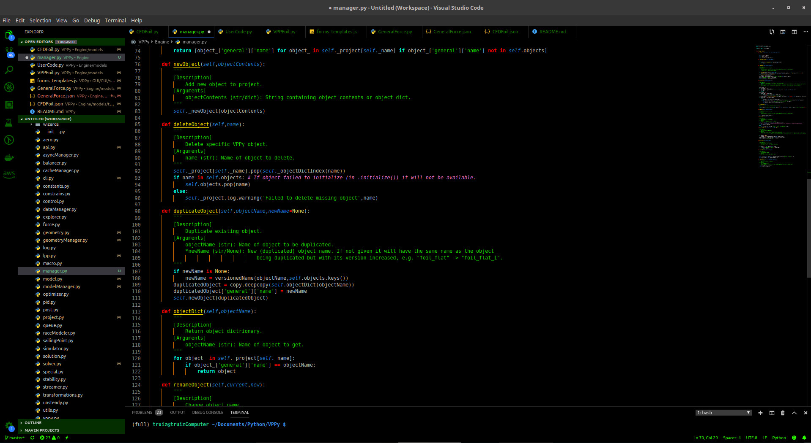

# TommyTachasTheme

### Important modifications (add to user settings):

"editor.tokenColorCustomizations": {
    "[TommyTachas]": {
        "textMateRules": [
            {
                "scope": [
                    "meta.function-call",
                ],
                "settings": {
                    "foreground": "#0095ff"
                }
            },
            {
                "scope": [
                    "meta.function-call.arguments.python",
                ],
                "settings": {
                    "foreground": "#ababab"
                }
            },
            {
                "scope": [
                    "constant.other.caps.python"
                ],
                "settings": {
                    "foreground": "#ffc800",
                }
            },
            {
                "scope": [
                    "variable.language.special.self.python"
                ],
                "settings": {
                    "foreground": "#ff007b",
                }
            },
            {
                "scope": [
                    "comment.line.number-sign.python"
                ],
                "settings": {
                    "foreground": "#ff68dea2",
                    "fontStyle": "italic"
                }
            },
            {
                "scope": [
                    "keyword.control.flow.python"
                ],
                "settings": {
                    "foreground": "#ff6200",
                    "fontStyle": "bold underline"
                }
            },
            {
                "scope": [
                    "keyword.operator.logical.python",
                    "keyword.operator.comparison.python",
                    "keyword.control.import.python"
                ],
                "settings": {
                    "foreground": "#ff0000",
                    "fontStyle": "bold"
                }
            }
        ]    
    }
